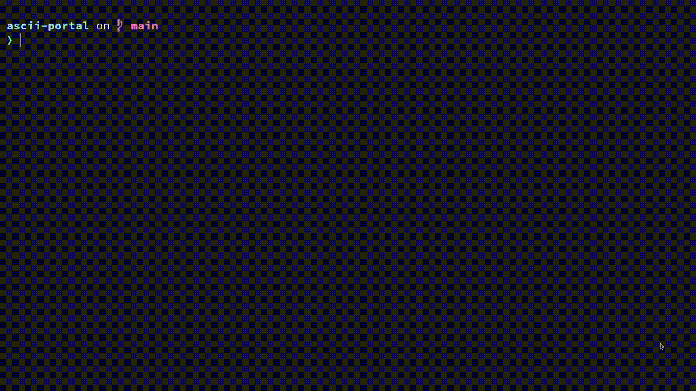

# ascii-portal

A stupid simple implementation of something vaguely resembling the game Portal.

***NOTE***: After thinking I knew exactly how I wanted to build this, I slowly
started realizing I did not. It'll take me a little longer to get things done
while I test some proof of concept things that I will use in this game.

This game uses the ncurses library and terminal colors.



## Installation and Running

On Linux (and macOS):

```bash
# Clone the repository
git clone https://github.com/alex-laycalvert/ascii-portal.git

# cd yourself into the repo directory
cd /path/to/where/you/cloned/ascii-portal

# Build using make
make

# Optionally build using gcc
gcc src/main.c -lncurses -o portal

# Or make a dev build if you want to contribute
make dev

# Run
./portal

```

On Windows:

```bash
# Sorry (maybe coming soon... probably not)
```

## Gameplay

You are the green box that starts in the middle of the map.

To quit the game at any time, press Q.

To move, use the keybindings:

- W (Up)
- A (Left)
- S (Down)
- D (Right)

To change the direction you're looking (the arrow around your character) use
the arrow keys.

To shoot a portal, press Space.

The default portal you shoot is the blue portal, to toggle which portal you shoot,
press Tab.

Walking into a portal will transport you to the opposite colored portal,
assuming it has been set.
